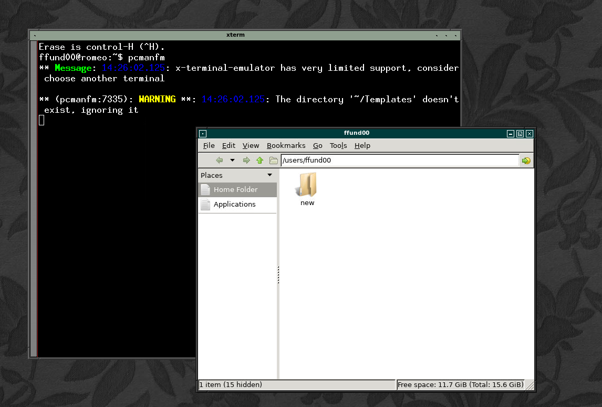
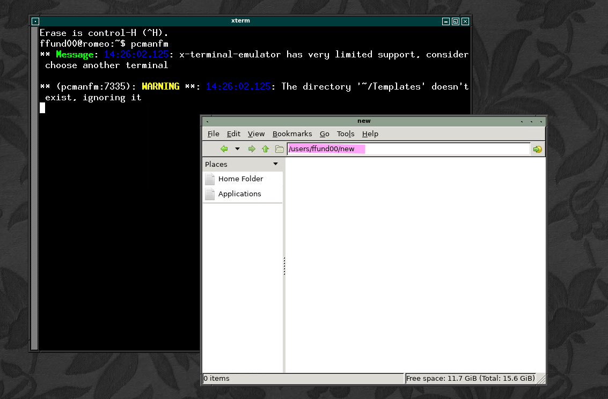
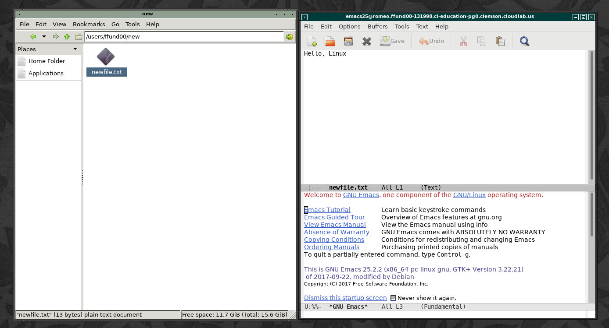

# Hello, Linux

In this tutorial, you will learn some basic commands for nagivating the Linux filesystem and for working on remote Linux hosts. It should take you about 90-120 minutes to work through this tutorial.

Before you can run lab experiments on CloudLab, you will need to set up an account and join a project under the supervision of a research advisor or a course instructor. If you haven't set up your CloudLab account yet, follow the instructions in [Hello, CloudLab](https://teaching-on-testbeds.github.io/hello-cloudlab/) to do so.


## Reserve and log in to resources on CloudLab

For this experiment, we will use the CloudLab profile available at the following link: [https://www.cloudlab.us/p/cl-education/hello-linux](https://www.cloudlab.us/p/cl-education/hello-linux)

You'll see a brief description of the profile. Click "Next". On the following page, you'll see a diagram of your experiment topology (on the right - in this case, a single host named "romeo"), and on the left you'll be asked to select the "Cluster" on which you want your experiment to run:

This experiments can run on any cluster. However, since CloudLab is a shared resource, on some occasionas the cluster you select might not have enough available resources to support your experiment. The status indicator next to each cluster tells you roughly how heavily utilized it is at the moment - green indicates that there are not many users, orange means heavy load, and red means that it is almost fully utilized. You are more likely to be successful if you choose a cluster with a green indicator.

After you select a cluster, you can leave the "Name" field blank, or give your experiment a name - it's your choice. Also make sure your "Project" is selected. Then, click "Next".

On the last page, you'll be asked to set the duration of your experiment. At the end of this duration, your resources will be deleted automatically - so make sure to give yourself enough time to finish.

You can leave the start date/time on this page blank if you are ready to work on the experiment right now. 

When you have made all your choices, click "Finish" to ask CloudLab to reserve resources according to your configuration.

Once you have successfully instantiated a profile, it will still take some time before your resources are ready for you to log in.

As your resources come online, you'll see their progress on the CloudLab experiment page. Once the host in your experiment is "green" and has a "✓" icon in the top right corner, it is ready for you to log in! For this experiment, you should log in to your host in two ways:

* Open an SSH session using a terminal application that is installed on your laptop or PC
* Open a VNC session (for a graphical interface)

(You can refer back to the [Hello, CloudLab](https://teaching-on-testbeds.github.io/hello-cloudlab/) experiment, if you don't remember how to open a terminal session or a VNC session!)

## Distinguishing local and remote terminals

### Exercise - local and remote terminals

For CloudLab-based lab assignments, the only commands you will run on your *local* host (your laptop are PC) are SSH or SCP commands, to log in to or transfer files from hosts on CloudLab. **All other commands will run on CloudLab hosts**. It's therefore very important to be able to identify *where* a command will run. You can do this by looking at the terminal *prompt*!

When you first open a new terminal window in the terminal application that is installed on your laptop or PC, you'll have a _local_ shell open. Make a note of what the prompt looks like. For example, mine looks like this:

```
ffund@ffund-xps:~$
```

It shows my username (`ffund`), hostname (`ffund-xps`), my current
working directory (`~`, which is shorthand for my home directory), and then a `$` to signify that I'm working as a
normal (unprivileged) user. (If I was working as the privileged "root" user,
the prompt would end with a `#` instead.) Yours may look similar, or very different - it will depend what type of terminal application you are using.

When you log in to a remote host using an `ssh` command, the terminal prompt will change - at the very least, it will show the hostname of the remote host instead of the hostname on the laptop you are working on. When working on remote hosts, the prompt is useful for determining *where* you are running a command.

In particular, if your SSH session is idle for some time, you may find that you get disconnected from the remote host. When you try to type a command in the terminal window, you'll see something like this:

```
ffund01@romeo:~$ packet_write_wait: Connection to 206.196.180.202 port 25106: Broken pipe
ffund@ffund-xps:~$ 
```

This indicates that you've been disconnected from the remote host, and any command you run now will execute on your _local_ system, and not on the remote host. To log back in to the remote host, just use the "up" arrow on your keyboard to fill in the last command you ran - which will have been the SSH login command - and then hit "Enter".

Keep an eye on that terminal prompt while you are working on the lab exercises in this course, since the lab procedures only "work" if you run the commands in the right place! You may get disconnected without realizing it. If you run a command and don't get the expected output, check the terminal prompt to make sure that your SSH session is still alive. 

> **Note**
> *All* of the commands in this experiment, except for SSH and SCP commands, should be executed in the terminal on the remote host you have reserved on CloudLab.


**Lab report**: Show a screenshot or copy and paste from your terminal to show the terminal prompt of your _local_ shell. 

**Lab report**: Show a screenshot or copy and paste from your terminal to show the terminal prompt when you are logged in to the "romeo" host in your experiment.

## Learning the basics of the Bash shell

When you run commands in a terminal environment, you are actually *programming* 
the computer. Each command is a line of code, that is then executed by an *interpreter*.

(You may be familiar with the idea of an interpreter if you have ever used Python - 
in interpreted programming languages, code is not translated into machine code by a compiler in advance of execution. Instead, the code is translated into machine code, one line at a time, by an interpreter *as the program runs*.)

The most common shell, or command language interpreter, you'll encounter on Linux systems, and the one we'll use in this course, is called Bash. In this lab exercise, you will learn some basic commands you can use to "program" in the Bash shell environment.

We will start with the standard "hello world" exercise that is often 
a first introduction to a new computing environment or language.

For the standard "hello world" exercise, we use the `echo` command to 
print a quoted string to the terminal output. At the terminal prompt on the remote host, type:

```
echo "Hello world"
```

and then hit Enter to run the command you've just entered.

Like other programming languages, you can define and use variables in the Bash shell. To see how this works, try defining a new variable called `mymessage` by assigning a value to it:

```
mymessage="hello world"
```

(note that there is no space on either side of the `=`).


You can then access the value stored in the variable in your Bash "code" by prefacing the variable name with a `$` sign. Try running:

```
echo $mymessage
```

In addition to assigning a value to a variable manually, you can also make a variable take on the output of a command as its value. For example, the command `whoami` will return your current username. Try running it now:

```
whoami
```

To assign its output to a variable, we enclose it in `$()` when doing the assignment - this tells the shell to evaluate the command and use its output:

```
myname=$(whoami)
```

You can now use the `myname` variable in another command:

```
echo "$mymessage, $myname"
```

You can even use the output of one command directly in another command, without assigning it to a variable - try


```
echo "$mymessage, $(whoami)"
```

This feature is known as *command substitution*.


### Exercise - tab autocompletion


Many terminals have a feature called "tab autocompletion" where, when 
you type a partial command and then press the Tab key, it will 
finish the command for you.

Let's try this with the `whoami` command. First write out the entire command:

```
whoami
```

When you hit Enter, you should see that this command returns your 
username. Now try typing just

```
whoa
```

and then hit Tab. At the prompt, the rest of the command `whoami` should
be filled out, and you can then hit Enter to run it.

Tab autocompletion will only fill out the entire command if only one command on the 
system matches what you've entered so far. If there are multiple matching 
commands, Tabl will show you all of them. You'll have to continue 
typing out the one you want until there is only one match, and then Tab
will autocomplete it for you. Try typing

```
who
```

**without hitting Enter** and then hit Tab to see how this works.

Tab autocompletion also works for file and directory names, for arguments to 
many commands, and for variables.

For example, suppose you save the string "hello world" in a new variable called
`mymessage` like this:

```
mymessage="hello world"
```
(note that there is no space on either side of the `=`).

You can then type 

```
echo $mym
```

**without hitting Enter** and hit Tab, and it will be autocompleted to `echo $mymessage` (which 
will print "hello world" to the terminal output).


### Exercise - History

It's often useful to be able to see and re-run commands you've previously run. 

You can use the up arrow and down arrow keys to scroll 
through your previous commands. Or, to see your command history all at once, run

```
history
```

You'll note that each line in the output of the `history` command has a number 
next to it, with which you can re-run that command. To run a command that 
appears as number `1` in your history, run

```
!1
```

or, to quickly run your last command again (without having to specify the 
number), you can run 

```
!!
```

Sometimes you want to run the same command again, but with different arguments; 
or run a different command on the same arguments (for example, if you are doing
several operations on a file.) Here are some useful shortcuts you can try:

```
!:0 # command only of last command in history
!^  # first argument of last command in history
!*  # all arguments of last command in history
!$  # last argument of last command in history
```

## 1.2 Navigating the filesystem


In this section, you will learn about the structure of the Linux filesystem, and some basic commands for navigating the filesystem: `pwd`, `ls`, `cd`, `mkdir`

### Exercise - Basic filesystem navigation

First, check where you are currently located in the filesystem with the `pwd`
("**p**rint **w**orking **d**irectory") command:

```
pwd
```
Next, **l**i**s**t the contents of the directory you are in:

```
ls
```

To create a new directory inside our current directory, run `mkdir` and 
specify a name for the new directory, like

```
mkdir new
```

You can **c**hange **d**irectory by running `cd` and specifying the directory
you want to change to. For example, to change to the directory you've just 
created, run

```
cd new
```

and then use 

```
pwd
```

again to verify your current working directory.

From your regular usage of a laptop or PC, you may be more familiar with a graphical "file explorer" representation of a filesystem. You can use the VNC session you opened earlier to explore the filesystem and understand the equivalence between the terminal commands (like `cd`) and commands in the graphical explorer (like double-clicking on a folder icon).

Inside the VNC session, run

```
pcmanfm
```

to open a graphical file explorer. (You can click and drag on the window title bar to move it around inside the VNC session.)

By default, the file explorer will open your home directory. You'll see the path to your home directory in the address bar at the top of the file explorer (similar to what you would get from the output of `pwd`), and you'll see a listing of the directory contents (like the output of `ls`) in the main part of the window:



The "new" directory that you created earlier will be visible inside your home directory.  When you double click on the folder icon labeled "new" (which is equivalent to using `cd` to change to this directory), the path in the address bar will change to reflect your new working directory, and the main part of the window will show the contents of the "new" directory (which is currently empty.)



### Exercise - Relative and absolute paths

You may have noticed that when you run the `pwd` command in your terminal, it gives you 
a full path with several directory names separated by a `/` character.
This is a _full path_. For example, after running the commands above, I would see
the following output for `pwd`:

```
/users/ffund00/new
```

When you run commands that involve a file or directory, you can always 
give a full path, which starts with a `/` and contains the entire directory
tree up until the file or directory you are interested in. For example, if my home directory is
`/users/ffund00`, I can run 

```
cd /users/ffund00
```

to return to your home directory. Alternatively, you can give a path that is
_relative_ to the directory you are in. For example, when I am inside my home
directory (`/users/ffund00` - yours will be different), which has a directory 
called `new` inside it, I can navigate into the `new` directory with 
a relative path:

```
cd new
```

or the absolute path:
 

```
cd /users/ffund00/new
```

The concepts and commands in this section will be essential for future lab assignments. They will be especially important when you use `scp` to retrieve data from your experiments (which you'll learn more about shortly) - you will need to be able to find out the absolute path of the file you want to retrieve, so that you can use it in your `scp` command.


Some useful shortcuts for navigating the filesystem:

* Running `cd` with no argument takes you to your home directory.
* The shorthand `..` refers to "the directory that is one level higher" (can be
used with `cd` and with other commands).
* The shorthand `~` refers to the current user's home directory (can be used 
with `cd` and with other commands).
* After navigating to a new directory with `cd`, you can then use `cd -` to 
return to the directory you were in previously.

Try these commands. Before and after each `cd` command, run `pwd` to see
where you have started and where you ended up after running the command.


```bash
cd       # takes you to your home directory
cd ..    # takes you one directory "higher" from where you were before
cd ~     # takes you to your home directory
cd ../.. # takes you two directories "higher" from where you were before
cd -     # takes you to the directory you were in before the last time you ran "cd"
```


Then, return to your home directory.

## Working with files and directories

In this section, you will learn how to work with files and directories, using the commands: `cp`, `rm`, `mv`, `cat`, `wget`, `nano`                                     

### Exercise - Creating a file

The easiest way to create a file is to just open it for editing in your terminal session. 
We will use the `nano` text editor to open file called `newfile.txt`:

```
nano newfile.txt
```

You can type some text into this file, then use Ctrl + O to write it 
**o**ut to file, and hit Enter to confirm the file name to which to save.
Near the bottom of the screen, it should say e.g. "[ Wrote 1 line ]".
Then use Ctrl + X to exit.

To see the contents of a file, we can print the contents of the file 
to the terminal output with `cat`:

```
cat newfile.txt
```

You can edit an existing file with `nano`, too. Open the file again with

```
nano newfile.txt
```

and you can change its contents. The use Ctrl + O to write it 
**o**ut to file, and hit Enter to confirm the file name to which to save.
Use Ctrl + X to exit.

If you refer back to your graphical VNC session, you'll see the text file you created in the file explorer, and you can double-click it to open it in a text editor:




You will use `nano` often in the lab, for example when you are asked to modify a configuration file for a networked service. Take a few moments now to practice using it and become familiar with how it works.


### Exercise - copying and moving files around the filesystem

You may already know how to use a graphical file explorer to copy and paste files, or move files around a filesystem. But it's very useful to also know how to do this in a non-graphical terminal session.

To copy a file, we use `cp`, and give the source and destination file names
as arguments:

```
cp newfile.txt copy.txt
```

To move (or rename) a file, we use the `mv` command:

```
mv copy.txt mycopy.txt
```

and we use `rm` to delete a file:

```
rm mycopy.txt
```

With `rm`, there is no "Recycle Bin" and no getting back files you've 
deleted accidentally - so be very, very careful.

For this lab course, you may occasionally have to modify system configuration files that require system administrator privileges to edit. 
On Linux, to signal to the operating system that we want to run a command with admin privileges, we preface the command with `sudo` - "superuser do".

Try this now - open the log file `/etc/services`:

```
nano /etc/services
```

and try to add a comment (a line of text that begins with the `#` character) at the beginning of the file:

```
# this is a comment
```

Then, try to save your edit with Ctrl+O. You should see an error message: "Error writing /etc/services: Permission denied".

To edit this file, you will need to use `sudo`. First, quit your current `nano` session with Ctrl+X (when prompted to save your changes, type N for No.) Then, open the file again with `sudo`:


```
sudo nano /etc/services
```

Now, you should be able to add the line

```
# this is a comment
```

at the beginning of the file, and then save the file before quitting `nano`.


### Exercise - flags, man page and `--help`

Bash utilities typically have some flags you can use to modify the way 
they behave, or what their output looks like. 

For example, take the `ls` command. We can:

* See one file per output line: `ls -1`
* See "long" output that includes file permissions, ownership, size, and modification dates: `ls -l`
* See "long" output and also sort files in order of time of last modification: `ls -lt`
* See "long" output and sort files so that the most recently modified file is last: `ls -ltr`

With most utilities, you can use the `--help` flag to find out how to use 
the utility and what flags are available for it:

```
ls --help
```


You can also use the `man` command to read the complete user manual for a command. Try

```
man ls
```

This is not exclusive to the `ls` command - virtually *every* Linux command has some extra help output or a man page associated with it, that you can use to learn how to use it.

### Exercise - Retrieving files from the Internet

Use `wget` to download a file from the Internet. 

For example, to download a file I've put at 
https://witestlab.poly.edu/bikes/README.txt
we can run

```
wget https://witestlab.poly.edu/bikes/README.txt
```

Then, use

```
ls
```

to verify that you have retrieved the file, and

```
cat README.txt
```

see its contents.
Similarly, you can download anything from the web by URL.

> **Note**: Occasionally, students may see the following error when attempting this exercise:
> 
> Resolving witestlab.poly.edu (witestlab.poly.edu)... failed: Temporary failure in name resolution.
> wget: unable to resolve host address ‘witestlab.poly.edu’
> 
> This can happen if there is a problem with the DNS server at the testbed site you are using. To practice using `wget`, you can just use a different URL instead. For example:
> 
> `wget https://raw.githubusercontent.com/teaching-on-testbeds/hello-linux/main/index.md` 


### Exercise - Transferring files to and from remote hosts

When running lab exercises, you'll generate data on remote hosts on a testbed, and then you will have to transfer the data back to your laptop for analysis.

To move files back and forth between your laptop and a remote system that you access with `ssh`, we can use `scp`. The syntax is:

```
scp [OPTIONS] SOURCE DESTINATION
```

where `SOURCE` is the full address of the location where the file is currently llocated, and `DESTINATION` is the address of the location that you want to copy a file to.

When you are transferring a file from a remote host (e.g. a host on a testbed) to your laptop, you will run `scp` from a terminal *on your laptop* (NOT a terminal that is logged in to the remote host), and the syntax will look like this:

```
scp -i PATH-TO-KEY -P PORT USERNAME@HOSTNAME:REMOTE-FILE-PATH LOCAL-FILE-PATH
```

For example, if the file is located on a remote host where

* the location of the key you use to SSH into the remote host is `~/.ssh/id_rsa`
* the port you use to SSH into the remote host is  22
* the username you use to SSH into the remote host is ffund00
* the hostname you use to SSH into the remote host is ffund00@clnode053.clemson.cloudlab.us
* the location of the file you want to copy on the remote host is `~/new/newfile.txt` (i.e. a file named `newfile.text` inside a directory called `new` which is inside your home directory)
* and you want to copy the file to the location on your laptop from which you run the `scp` command (`.` is shorthand for "my current working directory"), 

you would run

```
scp -i ~/.ssh/id_rsa -P 22 ffund00@clnode053.clemson.cloudlab.us:~/new/newfile.txt .
```

and the output would look like this:

```
newfile.txt                                      100%    13     0.1KB/s   00:00    
```

and then, when you run `ls`, you should see the `services` file in your current directory. 


> **Note**
> Avoid a common SCP error: don't forget the last argument that specifies the local path to which you want to copy the file - in this example, the `.` which signifies "copy to my current working directory"! 


You'll have to make sure you have the necessary file permissions to write files to the directory you are working in! If you get a message indicating a file permission error, you may have to specify a path to a directory in which you have write permission, instead of the `.` argument.

**Lab report**: Transfer the file located at `~/new/newfile.txt` on your "romeo" host to your laptop. Include a screenshot, or copy and paste from your terminal, to show the command you ran *and* the result showing a successful file transfer. For example

```
ffund@ffund-XPS-13-9300:~$ scp -i ~/.ssh/id_rsa -P 22 ffund00@clnode053.clemson.cloudlab.us:~/new/newfile.txt .
newfile.txt                                                                                                                                                                                      100%   13     0.1KB/s   00:00    
```


##  Manipulating output of a command

In this section, you will learn how to use the commands `head`, `tail`, `less`, and `grep` to manipulate the output of a command. You'll also learn how to do I/O redirection with `>` and `>>`.

### Exercise - See more or less

When working in a terminal session, we'll often want to see more or less of a command that has a lot of output.

As an examples, we will use the file `/etc/services`. This file lists networked service names, along with the port number and transport-layer protocol each one uses.

If you run

```
cat /etc/services
```

to see the contents of the file, you won't see much - there's just too much 
output, and it goes by too quickly.

To see the beginning of the file, use

```
head /etc/services
```

To see just the end, use

```
tail /etc/services
```

You can also specify the number of lines to see with either command, with e.g.

```
head --lines=5 /etc/services
```

or

```
tail --lines=10 /etc/services
```

To page through one line of output at a time, use

```
less /etc/services
```

which will show the entire file, but one "page" a time. Use Enter, the up and down arrow keys, or the Page Up and Page Down keys to scroll through the file, or press `q` to quit at any time.

One useful feature of `less` is the ability to search for a word. Suppose you want to know what port the `smtp` mail service uses. You can open the file with

```
less /etc/services
```

Then, while the file is open with `less`, type

```
/smtp
```

and hit Enter. This will search the file for the first occurence of the word `smtp`, go to that part of the file, and highlight the matching word. (Once you have tried this, you can use `q` to close the file.)


Finally, suppose you want to be able to see only lines matching a particular pattern.
There's a very powerful utility called `grep` that allows us to filter
a file or other input to see only those lines that contain a particular word.
For example, to see lines containing the word "ftp", you can run

```
grep "ftp" /etc/services
```

and you will see only the lines containing the word "ftp". Note that this is case-sensitive; you won't see the same lines if you run

```
grep "FTP" /etc/services
```


### Exercise - I/O redirection and pipes


For example, suppose we want to get all of the lines in `/etc/services` related to services that operate over the UDP networking protocol. We can save those lines to a file called `udp-services.txt` in our home directory, by using the `>` operator to redirect the output of the `grep` command:

```
grep "udp" /etc/services > ~/udp-services.txt
```

We may occasionally want to send the output of a command to a file, 
but append to an existing file rather than create a new one (as `>` does). To 
append to an existing file we will use `>>`. 

For example, to create a file called `routing-services.txt` 
that contains the lines in `/etc/services` 
related to the routing services `ripd` and `bgpd`, run

```
grep "ripd" /etc/services > ~/routing-services.txt
grep "bgpd" /etc/services >> ~/routing-services.txt
```

The second line won't overwrite the text that is written to `routing-services.txt`
in the first line; it will append to the file instead.

One valuable feature of the Bash shell is the ability to "chain" together multiple
utilities by using the _pipe_ operator, `|`. This operator takes the output of the command
*before* the pipe, and uses it as input to the command *after* the pipe.

We can use this feature to filter the output of any command with `grep` (although that's not the only usage!). For example, suppose we want to see the MAC address of every network interface card on the host.  We can "pipe" the output of the `ifconfig` command to `grep`:

```
ifconfig -a | grep "ether"
```

We can even use the pipe operator to connect more than two commands. For example, let's try using the `awk` utility to print only the second "column" of output from the previous command:

```
ifconfig -a | grep "ether" | awk '{print $2}'
```

If you see a piped command sequence and you're unsure what each part does, a good way to find out is to gradually build up the sequence from left to right. For example, for the command sequence above, if you want to find out what it does you might first run:


```
ifconfig -a 
```

Then add


```
ifconfig -a | grep "ether" 
```

to see how the output of `ifconfig` is modified by the `grep` command. Finally, run

```
ifconfig -a | grep "ether" | awk '{print $2}'
```

and compare to the previous output, to see what the `awk` command does. 


---

<small>Questions about this material? Contact Fraida Fund</small>

---

<small>This material is based upon work supported by the National Science Foundation under Grant No. 2231984.</small>
<small>Any opinions, findings, and conclusions or recommendations expressed in this material are those of the author(s) and do not necessarily reflect the views of the National Science Foundation.</small>
